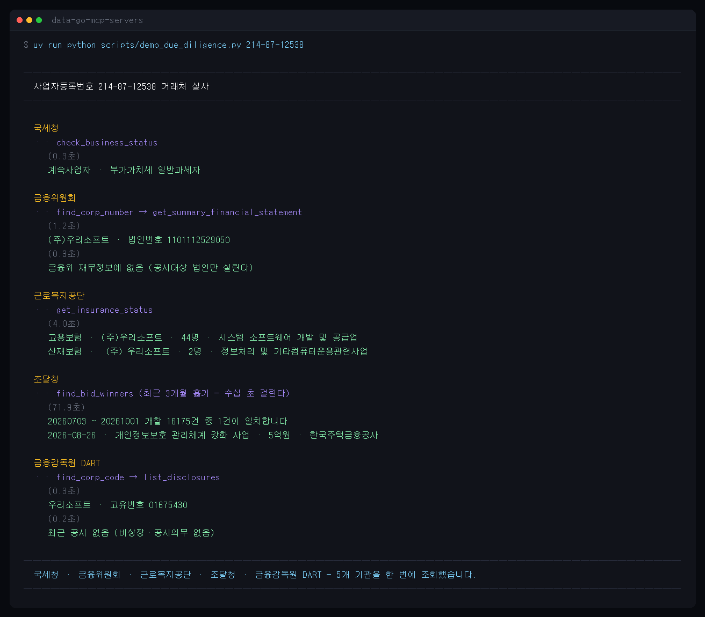

# data-go-mcp-servers

[한국어](README.md) · **English**

Korean public-data APIs as MCP (Model Context Protocol) servers. From Claude Desktop, Claude Code or any MCP client, query National Pension workplace enrolment and employment/industrial-accident insurance, business-registration status, public procurement bids, corporate financial statements and stock/index/ETF quotes, DART disclosures, Bank of Korea economic statistics, real-estate transaction prices, presidential speeches and chemical safety data (MSDS).

Based on [Koomook/data-go-mcp-servers](https://github.com/Koomook/data-go-mcp-servers) (Apache-2.0, unmaintained since 2025-09), rebuilt for mcp SDK 2.x. Tool names and parameters stay compatible with the original.

## Servers

| Server | Agency / data | Tools |
|---|---|---|
| [nps-business-enrollment](docs/guide/servers/nps-business-enrollment.md) | National Pension Service — workplace enrolment and withdrawal (+ legal-dong codes, employment/accident insurance) | `search_business` `get_business_detail` `get_period_status` `find_region_code` `get_insurance_status` `search_withdrawn_business` `get_withdrawn_business_detail` |
| [nts-business-verification](docs/guide/servers/nts-business-verification.md) | National Tax Service — business-registration validity and status | `validate_business` `check_business_status` `batch_validate_businesses` |
| [pps-narajangteo](docs/guide/servers/pps-narajangteo.md) | Public Procurement Service — bids, awards, contracts, supplier profiles and debarment records | `search_bid_announcements` `search_successful_bids` `search_contracts` `get_bid_detail` `find_bid_winners` `get_procurement_company` `check_procurement_sanctions` |
| [fsc-financial-info](docs/guide/servers/fsc-financial-info.md) | Financial Services Commission — corporate financials (+ corporate numbers, company outline, stock quotes, indices, ETFs) | `get_summary_financial_statement` `get_balance_sheet` `get_income_statement` `search_company_financial_info` `find_corp_number` `get_corp_outline` `get_stock_price` `search_stock_items` `get_market_index` `get_etf_price` |
| [presidential-speeches](docs/guide/servers/presidential-speeches.md) | Presidential Archives — speeches | `list_speeches` `search_speeches` `get_recent_speeches` |
| [msds-chemical-info](docs/guide/servers/msds-chemical-info.md) | KOSHA — chemical safety data sheets | `search_chemicals` `get_chemical_section` `get_complete_msds` and 4 more |
| [dart-disclosure](docs/guide/servers/dart-disclosure.md) | Financial Supervisory Service — DART filings (company profile, filing list and full text, financial statements) | `find_corp_code` `get_company` `list_disclosures` `get_key_accounts` `get_financial_statements` `get_disclosure_document` |
| [molit-realestate](docs/guide/servers/molit-realestate.md) | Ministry of Land — real-estate transaction prices (apartments, officetels, row houses, detached houses, commercial, factories/warehouses, land; sales and rents) and the building register | `search_property_trades` `search_property_rents` `get_building_register` |
| [ftc-ecommerce](docs/guide/servers/ftc-ecommerce.md) | Fair Trade Commission — mail-order (e-commerce) seller registrations | `get_online_seller` |
| [work24-jobs](docs/guide/servers/work24-jobs.md) | 고용24 (formerly WorkNet) — job postings, searchable by business number, with company size and requirements | `search_job_postings` `get_job_posting` |
| [bok-ecos](docs/guide/servers/bok-ecos.md) | Bank of Korea — ECOS statistics (policy rate, FX, prices, 100 key indicators) | `find_statistic_table` `get_statistic_items` `get_statistic_data` `get_key_statistics` `search_term` |

11 servers, 54 tools, 31 public APIs. Every tool is read-only, and failures come back as MCP error results (`isError`). Where one server uses several APIs (molit 12, fsc 5, nps 4, pps 3), each one needs its own usage request — see the table in [api-keys.md](docs/guide/api-keys.md). dart-disclosure (OpenDART), bok-ecos (Bank of Korea ECOS) and work24-jobs (고용24) use their own keys rather than the data.go.kr one.

## What makes this different

Most Korean public-data MCP servers wrap a single API. Here the agencies are joined up, so one business registration number walks across seven of them:



A real run of `scripts/demo_due_diligence.py` — live API calls, nothing staged.

Run it yourself — these are live API calls, so the numbers move:

```bash
uv run python scripts/demo_due_diligence.py 214-87-12538
```

Three more demos in the same style: [a company's winning bids](docs/guide/servers/pps-narajangteo.md#낙찰업체로-찾기) (`demo_bid_winners.py`), [apartment transactions in one district](docs/guide/servers/molit-realestate.md#지역코드-찾기) (`demo_realestate.py`) and [a company's open positions](docs/guide/servers/work24-jobs.md#사업자번호로-조회하기) (`demo_jobs.py`).

## Quick start

**New to this? → [Getting started](docs/guide/quickstart.md)** (10 minutes, no terminal required — Korean).

In short: get a data.go.kr key and request access to the APIs you need, drag [data-go-mcp-desktop.mcpb](https://github.com/hichang4u/data-go-mcp-servers/releases/latest/download/data-go-mcp-desktop.mcpb) into Claude Desktop → Settings → Extensions, enter your keys, and ask away.

To pick individual servers or configure them by hand:

1. Install [uv](https://docs.astral.sh/uv/getting-started/installation/)
2. Get a [data.go.kr](https://www.data.go.kr) key (the **Decoding** one) and request access to the APIs you want → [docs/guide/api-keys.md](docs/guide/api-keys.md)
3. Add to Claude Desktop's `claude_desktop_config.json`:

```json
{
  "mcpServers": {
    "nts-business-verification": {
      "command": "uvx",
      "args": [
        "--from",
        "git+https://github.com/hichang4u/data-go-mcp-servers#subdirectory=src/nts-business-verification",
        "data-go-mcp.nts-business-verification"
      ],
      "env": { "API_KEY": "<your data.go.kr key>" }
    }
  }
}
```

For another server, swap `nts-business-verification` for its name. Only `dart-disclosure` differs: `"env": { "DART_DISCLOSURE_API_KEY": "<your OpenDART key>" }` (a separate key — see [api-keys.md](docs/guide/api-keys.md) §4), and `bok-ecos` takes `BOK_ECOS_API_KEY` (§5). For `all-servers` (every tool in one process), Claude Code, Cline, [Smithery](https://smithery.ai/servers/hichang4u/data-go-mcp) (`smithery mcp add hichang4u/data-go-mcp`) or running from a clone, see [docs/guide/installation.md](docs/guide/installation.md).

```
> Check the status of business registration number 120-88-00767
Active taxpayer, standard VAT …
```

## Documentation

The guides are written in Korean, since the data and the portal are.

| | |
|---|---|
| Using | [Getting started](docs/guide/quickstart.md) · [Installation and client setup](docs/guide/installation.md) · [API keys and access requests](docs/guide/api-keys.md) · [Troubleshooting](docs/guide/troubleshooting.md) · [Tool reference per server](docs/guide/servers/) |
| Developing | [CONTRIBUTING](CONTRIBUTING.md) · [Architecture](docs/development/architecture.md) · [Adding a server](docs/development/adding-a-server.md) · [Testing](docs/development/testing.md) · [Releasing](docs/development/release.md) |
| History | [PRD](docs/development/PRD.md) · [Plan](docs/development/PLAN.md) · [Upstream records](docs/history/) |

## Development

```bash
git clone https://github.com/hichang4u/data-go-mcp-servers && cd data-go-mcp-servers
uv sync --dev --all-packages
cp .env.example .env                            # fill in API_KEY, DART_DISCLOSURE_API_KEY, BOK_ECOS_API_KEY for live tests
uv run pytest                                   # 482 tests; live calls run under -m integration
uv run ruff check src scripts tests && uv run pyright src scripts tests
uv run python scripts/check_apis.py             # are the APIs alive, and does the key have access
```

Python 3.10+, `mcp>=2.2`. CI runs pytest, ruff and pyright on ubuntu/windows × 3.10/3.13.

## License

Apache-2.0. Upstream copyright notices are kept in [NOTICE](NOTICE) and in each package's LICENSE. This project is not affiliated with data.go.kr or any of the agencies; use of the data follows each API's own terms.
