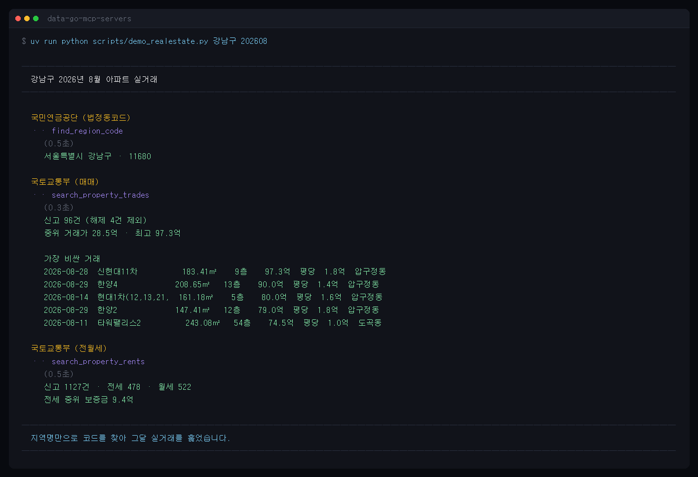

# 국토교통부 부동산 실거래가 (molit-realestate)

아파트·오피스텔·연립다세대·단독다가구·상업업무용·공장창고·토지의 **신고된 실거래가**를 지역(시군구)과 계약년월로 조회한다. 매매 7종, 전월세 4종.

## 데이터셋

| 종류 | 매매 (신청 페이지) | 전월세 (신청 페이지) |
|---|---|---|
| 아파트 | [매매 상세](https://www.data.go.kr/data/15126468/openapi.do) | [전월세](https://www.data.go.kr/data/15126474/openapi.do) |
| 오피스텔 | [매매](https://www.data.go.kr/data/15126464/openapi.do) | [전월세](https://www.data.go.kr/data/15126475/openapi.do) |
| 연립다세대 | 포털에서 "연립다세대 매매 실거래가" 검색 | "연립다세대 전월세 실거래가" |
| 단독/다가구 | [매매](https://www.data.go.kr/data/15126465/openapi.do) | "단독/다가구 전월세 실거래가" |
| 상업업무용 | [매매](https://www.data.go.kr/data/15126463/openapi.do) | 없음 |
| 공장·창고 | 포털에서 "공장 및 창고 등 부동산 매매 실거래가" 검색 | 없음 |
| 토지 | 포털에서 "토지 매매 실거래가" 검색 | 없음 |

쓰려는 종류마다 **각각 활용신청**이 필요하다 (자동 승인). 신청하지 않은 종류는 `data.go.kr 오류 [30]` 이 난다.

건축물대장은 [국토교통부_건축HUB_건축물대장정보 서비스](https://www.data.go.kr/data/15134735/openapi.do)를 따로 신청한다 (역시 자동 승인).

## 건축물대장으로 잇기

실거래 결과의 `bun`·`ji`(본번·부번)를 `get_building_register` 에 그대로 넘기면 그 거래가 일어난 건물의 대장이 나온다 — 연면적·주용도·구조·사용승인일·층별 면적.

```
> 강남구 8월 아파트 실거래가        → bun 0493, ji 0000
> 그 건물 건축물대장 보여줘          → 연면적 8,862㎡ · 업무시설 · 1978 사용승인
```

- 지번은 **본번·부번 네 자리**다. 툴이 `493` 을 `0493` 으로 채워 보낸다.
- 종류는 표제부·총괄표제부·기본개요·층별개요·전유공용면적·주택가격·지역지구·부속지번. **집합건물과 일반건축물은 채워지는 종류가 다르다** — 어떤 종류는 0건으로 온다.
- 이 API 는 `SERVICETIMEOUT_ERROR`(503)를 자주 돌려준다. 툴이 세 번까지 다시 시도한다 (동 전체처럼 무거운 조회일수록 잦다).

## 지역코드 찾기



위는 `scripts/demo_realestate.py` 를 실제로 돌린 화면이다.

조회에 필요한 것은 법정동코드 **앞 5자리**(시군구)다. nps 서버의 `find_region_code` 가 찾아 준다:

```
> 강남구 지역코드 알려줘        → region_cd 1168000000
> 강남구 2026년 8월 아파트 실거래가   → LAWD_CD 11680 으로 조회
```

10자리 코드를 그대로 넣어도 앞 5자리만 써서 조회한다. 다만 **시도 단위 코드(`1100000000`)는 쓸 수 없다** — 시군구까지 좁혀야 한다.

## 예시 프롬프트

- "강남구 2026년 8월 아파트 매매 실거래가 보여줘"
- "11680 지역 오피스텔 전월세 계약 중 전세만 추려줘"
- "작년 8월과 올해 8월 아파트 거래 건수를 비교해줘" (월별로 나눠 호출된다)
- "강남구 토지 거래 중 가장 비싼 건"

## 알아둘 것

- 한 번에 **시군구 하나 + 계약년월 하나**만 조회한다 (API 제약). 여러 달·여러 구는 나눠 호출해야 한다.
- 금액 단위는 전부 **만원**이다 (`deal_amount: 790000` = 79억). 보증금·월세도 같다.
- **해제된 거래**가 섞여 온다 (`cancelled: true`). 시세를 볼 때는 제외한다.
- 면적은 종류마다 뜻이 달라 필드를 나눠 돌려준다: `exclusive_area`(전용), `total_floor_area`(연면적), `plottage_area`(대지), `land_area`(대지권), `building_area`(건물), `deal_area`(토지 거래면적).
- 전월세는 `monthly_rent` 가 0이면 전세다 — `rent_type` 에 `전세`/`월세` 로 표시해 돌려준다. 갱신 계약이면 `previous_deposit`/`previous_monthly_rent` 가 함께 온다.
- **잘못된 입력도 API 는 오류 없이 0건으로 답한다** (10자리 코드, 4자리 년월 등). 그래서 툴이 먼저 형식을 검사해 `입력값 오류` 로 막는다.
- 지번(`jibun`)은 일부가 `1***` 처럼 마스킹되어 온다. 개인정보 보호 때문이며 원본이 그렇다.

## 툴

<!-- tools:start -->

### `get_building_register`

건축물대장을 조회합니다. Look up the building register for one lot.

지번(본번·부번) 기준입니다. **실거래 결과의 bun/ji 를 그대로 넘기면** 그 거래가 일어난
건물의 연면적·용도·구조·사용승인일을 볼 수 있습니다. 종류를 바꾸면 층별 면적(층별개요),
용도지역(지역지구) 등도 조회됩니다. 집합건물과 일반건축물은 채워지는 종류가 달라, 어떤
종류는 0건으로 옵니다.

이 API 는 일시적으로 SERVICETIMEOUT 을 돌려줄 때가 있어 몇 번 다시 시도합니다.

| 파라미터 | 타입 | 필수 | 기본값 | 설명 |
|---|---|---|---|---|
| `region_code` | string | 예 |  | 법정동코드 10자리(예: 1168010500 삼성동) 또는 시군구 5자리. 5자리면 bjdong_code 도 함께 준다 |
| `bun` | string | 예 |  | 본번 (예: 493). 실거래 결과의 bun 을 그대로 쓴다 |
| `ji` | string (optional) |  |  | 부번 (예: 0). 없으면 0000 으로 조회한다 |
| `bjdong_code` | string (optional) |  |  | 법정동코드 5자리. region_code 가 10자리면 필요 없다 |
| `kind` | string |  | `표제부` | 대장 종류: 표제부, 총괄표제부, 기본개요, 층별개요, 전유공용면적, 주택가격, 지역지구, 부속지번 |
| `num_of_rows` | integer |  | `50` | 한 페이지 결과 수 (기본값: 100, 최대: 1000) |
| `page_no` | integer |  | `1` | 페이지 번호 (기본값: 1) |

### `search_property_rents`

부동산 전월세 실거래가를 조회합니다. Search reported rent contracts of real estate.

한 번에 **지역(시군구) 하나 + 계약년월 하나**만 조회합니다. 보증금·월세 단위는 **만원**이고,
월세가 0이면 전세입니다 (rent_type 으로 구분해 돌려줍니다). 갱신 계약이면 종전 보증금·월세가
함께 옵니다.

| 파라미터 | 타입 | 필수 | 기본값 | 설명 |
|---|---|---|---|---|
| `region_code` | string | 예 |  | 법정동코드. 시군구 5자리(예: 11680 강남구) 또는 10자리 전체 코드. 모르면 nps 서버의 find_region_code 로 먼저 찾는다 |
| `deal_ym` | string | 예 |  | 계약년월 YYYYMM (예: 202608) |
| `property_type` | string |  | `아파트` | 부동산 종류: 아파트, 오피스텔, 연립다세대, 단독다가구 (토지·상업업무용은 없음) |
| `num_of_rows` | integer |  | `100` | 한 페이지 결과 수 (기본값: 100, 최대: 1000) |
| `page_no` | integer |  | `1` | 페이지 번호 (기본값: 1) |

### `search_property_trades`

부동산 매매 실거래가를 조회합니다. Search reported sale prices of real estate.

한 번에 **지역(시군구) 하나 + 계약년월 하나**만 조회합니다 (API 제약). 여러 달을 보려면
월별로 나눠 호출하세요. 금액 단위는 **만원**이고, 해제된 거래는 cancelled=true 로 표시되니
시세를 볼 때는 제외하세요. 면적은 종류마다 뜻이 달라 각각 다른 필드로 돌려줍니다
(전용면적/연면적/대지면적/거래면적).

| 파라미터 | 타입 | 필수 | 기본값 | 설명 |
|---|---|---|---|---|
| `region_code` | string | 예 |  | 법정동코드. 시군구 5자리(예: 11680 강남구) 또는 10자리 전체 코드. 모르면 nps 서버의 find_region_code 로 먼저 찾는다 |
| `deal_ym` | string | 예 |  | 계약년월 YYYYMM (예: 202608) |
| `property_type` | string |  | `아파트` | 부동산 종류: 아파트, 오피스텔, 연립다세대, 단독다가구, 상업업무용, 공장창고, 토지 |
| `num_of_rows` | integer |  | `100` | 한 페이지 결과 수 (기본값: 100, 최대: 1000) |
| `page_no` | integer |  | `1` | 페이지 번호 (기본값: 1) |

<!-- tools:end -->
